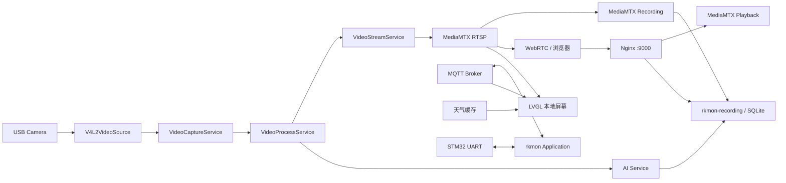

# 当前架构

## 进程边界

## C++ 主程序

入口是 `src/app/main.cpp`。入口只处理 `--config` 和 `--help`，配置由 `src/app/config.cpp` 读取并校验，服务由 `src/app/application.cpp` 的工厂按依赖顺序装配。

`Application` 持有控制邮箱、日志句柄和 `ServiceManager`。服务通过 `IService` 注入 logger 和故障回调，不直接依赖 Application。ServiceManager 先启动全部服务，失败时回滚；停止时先逆序请求停止，再逆序等待线程退出。

主程序中的大帧不经过控制邮箱。相机、解码、AI 和编码之间使用有界队列，视频队列满时按业务策略丢弃旧待处理帧，控制事件不采用丢旧策略。

## 运行时配套进程

- `mediamtx.service`：接收 `rkmon` 发布的 RTSP，提供 WebRTC、录像切片和 Playback API。
- `rkmon-recording.service`：运行 `src/recording/service.py`，维护录像 SQLite 索引、AI 事件和容量清理。
- `rkmon-display.service`：elf 用户图形会话内的 LVGL 本地监控。
- `rkmon-weather.service`：IP 城市定位、合肥回退和天气缓存更新。
- `mosquitto.service`：提供 MQTT broker。
- `nginx.service`：提供静态网页、录像 API、Playback 代理和 WebRTC 同源入口。

这些进程通过本机地址或 Unix Socket 通信，不把 MediaMTX 发布入口和录像目录直接暴露给网页。

## 数据流与所有权

V4L2 采集后复制到应用自有帧存储，帧通过有界队列传给下游。GStreamer 句柄封装在 media 实现内部；跨线程传递的帧需要保持底层内存和时间戳有效。AI 与编码是独立消费者，不能让慢 AI 阻塞实时视频出口。

当前解码闭环会把 NV12 输出复制为自有内存；不能据此宣称零拷贝。帧同时携带 sequence、单调时间戳和接收时间，后续事件或编码不能用完成时间覆盖来源时间。

## 生命周期和故障

服务线程必须响应 `request_stop` 并由拥有者 `join`。停止顺序是停止新任务、关闭生产者、唤醒等待、回收线程，再释放媒体和设备资源。模块故障通过回调上报；是否降级或重启由业务模块及 systemd 策略决定。

当前 systemd 对主程序、MediaMTX 和录像服务使用 `Restart=on-failure`。长时间稳定性、物理拔插恢复、端到端延迟和零拷贝仍需单独验证。
