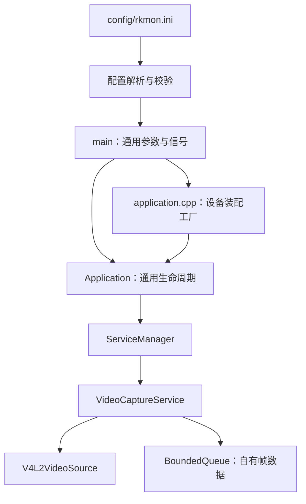

# 当前功能与框架检查

日期：2026-09-10。检查范围：入口、INI 配置、模块装配、服务生命周期、控制邮箱、日志、相机资源管理及启动脚本。以下结论基于代码检查、主机测试和 RK3588 本轮短时验证，不代表全产品功能已完成。

## 当前已实现

- C++17，主机和 ARM64 交叉编译；线程使用 `std::thread`、显式停止和 `join`。
- 通用入口只接收 `--config` / `--help`，设备参数放入统一 INI。当前支持 app、logging、camera 三节。
- 配置启动时集中校验，拒绝未知/重复字段、错误类型及越界值；路径相对于配置文件目录解析。
- 通用 `Application` 管理日志、控制邮箱和 `ServiceManager`，通过服务工厂注入设备；设备装配集中在 `application.cpp` 的 `make_service_factory()`。
- 启动失败回滚，两阶段逆序停止，工作线程故障上报，SIGINT/SIGTERM 唤醒应用关闭。
- V4L2 单平面 mmap 采集，MJPEG/YUYV，格式与帧率协商，可唤醒 poll，独立帧存储，容量受限的丢旧帧队列。
- 前台启动脚本保持 PID、信号及退出码，可从任意工作目录运行，支持自定义配置和二进制路径。

`main` 不处理相机参数，Application 的生命周期方法通过通用服务接口工作。新增设备需要增加相应配置结构和校验、实现 `IService`，然后在 `application.cpp` 的 `make_service_factory()` 中按依赖顺序注册。当前只实现已有设备，不为尚未开发的模块建立空服务。

## 本轮修复的问题

| 问题 | 处理 |
| --- | --- |
| 入口直接解释相机参数，Application 保存具体相机指针 | 通用入口读取配置；服务工厂负责装配，相机自行记录协商结果和统计 |
| 相机设备路径写死在生产代码 | 硬件路径移到仓库 INI，启用相机时必须提供 device |
| 启动失败仅显示 start returned false | ServiceManager 优先保留服务 health 中的具体错误 |
| 故障回调中日志或邮箱失败可能阻止应用退出 | 独立记录致命故障状态，邮箱拒收或上报异常时关闭邮箱唤醒控制线程 |
| 启动前已停止但仍会构造模块 | 装配前检查停止状态，避免继续创建设备模块 |
| 信号等待失败可能按成功退出 | 信号等待错误记录失败并返回非零；等待器析构负责停止、join 和恢复原信号屏蔽状态 |
| 脚本改变目录可能让配置和日志路径漂移 | 脚本解析绝对路径，INI 内相对路径统一以配置目录为基准 |

## 验证结果

- 主机 CTest：9/9 通过。覆盖核心组件、相机服务、INI、模块注入/回滚/邮箱满故障、启动脚本及信号退出。
- 主机和 ARM64 主工程合并文件后全部 11 个自有编译单元使用 `-std=c++17`，交叉编译成功。
- 板端配置测试、模块工厂测试、相机服务测试、Python 启动集成测试通过。
- 集成测试从含空格的其他工作目录调用脚本，验证 exec 后 PID 对应目标程序、日志相对路径、SIGINT/SIGTERM、配置错误和缺失设备的退出码。
- 板端 INI 默认 MJPEG 1920×1080：10 秒采集/消费 283 帧，28.2978 FPS，应用队列丢帧 0，超时 0。
- 慢消费者每帧等待 100 ms：10 秒采集 297 帧、消费 100 帧，29.4675 FPS，应用队列丢帧 193，超时 0。
- 同一 INI 经启动脚本运行真实相机，SIGINT 和 SIGTERM 均正常退出，连续启动可重新打开相机。

本轮板端验证目录：`/tmp/rkmon-ini-check.Y8vhcA`。测试不保存图像。短时平均帧率包含启动等待，不能据此认定严格稳定 30 FPS。

## 仍需注意的框架边界

1. **业务链路未闭合。** 正式应用暂未接入消费者；队列满后丢旧帧是当前预期行为。MJPEG 解码、预处理、AI、编码、推流均未实现。
2. **故障策略仍是整体退出。** 所有上报的 ServiceFault 都视为致命错误。添加其他设备时，要按业务确定哪些故障仅降级、哪些需要重启设备或退出进程；尚无自动重连、退避和独立模块恢复。
3. **生命周期操作依赖调用约定。** ServiceManager 启停必须由控制线程串行执行，依赖顺序由装配代码保证；没有依赖图解析。模块的 start 应在有限时间内完成，request_stop 必须唤醒阻塞 I/O；框架无法安全强杀卡死线程。
4. **重启时不能复用旧队列。** 相机服务可重新 start，但需要先停止/join，消费者重新获取 output。不要让 output/stats/negotiated_format 与重启并发；未来自动重连需要统一处理这些句柄。
5. **多消费者需要显式分发。** 多个线程读取同一个 BoundedQueue 会竞争取帧，不会每人收到同一帧。AI、编码、显示同时接入时需独立队列。
6. **日志仍有全局入口。** 当前进程只支持一个 Application 日志实例；相机使用注入的 logger，新增模块也应优先注入。若将来需要同进程多个 Application，必须进一步拆除全局日志状态。
7. **观测能力有限。** 当前 FPS 是运行区间均值，应用 queue_dropped 不包含驱动丢帧；帧时间戳是应用接收时间，不是曝光时间。尚无设备序号断档统计、端到端延迟或统一周期性指标出口。
8. **校验不等于硬件能力保证。** INI 中格式/尺寸/FPS 经驱动协商后可能调整，目前会记录实际结果；如业务必须精确满足某档位，后续应增加严格协商策略。
9. **验证覆盖有限。** 尚未进行本轮长时间压力测试、真实物理拔插、图像完整解码和多模块持续运行；没有宣称无竞态或达到生产可靠性要求。

结论：本轮检查未发现阻碍继续实现单路相机消费链路的问题；框架已具备添加设备模块的入口和统一生命周期，但恢复策略、分发和观测仍需在对应业务加入时完善。下一步应先补 MJPEG 解码消费者，验证原始图像输出，再继续后续视频处理。
